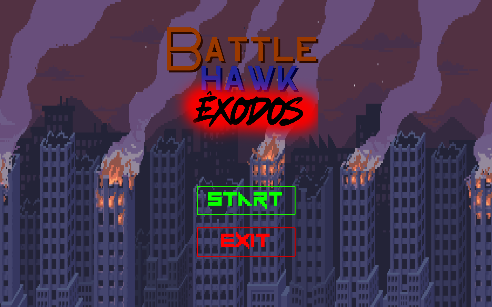
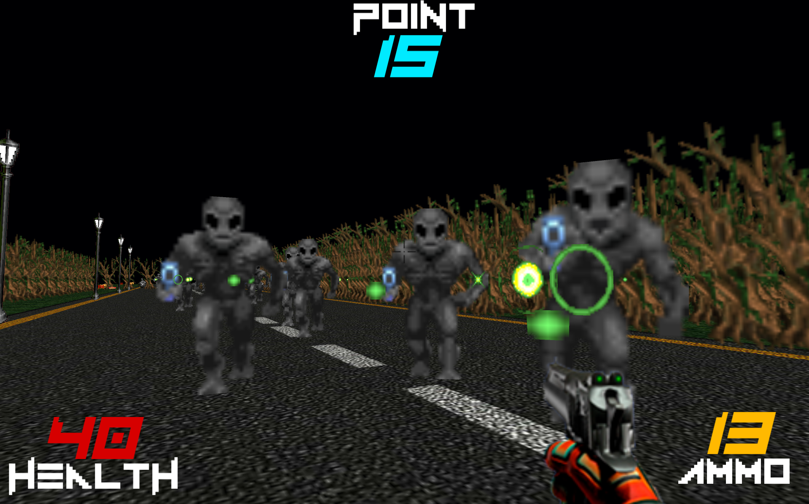
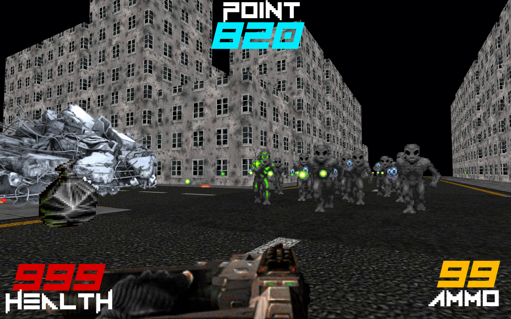

# Battlehawk: Êxodos

Jogo de ação em 2D no estilo dos clássicos shooters old-school (Doom-like), desenvolvido em Unity 2D. Desenvolvido para a Feira Técnica 2024 do Colégio Univap.

---

## Capturas de tela

## Sobre o jogo

Battlehawk: Êxodos é um jogo de ação/tiro em 2D inspirado nos clássicos shooters old-school como Doom, trazendo a atmosfera tensa e o ritmo acelerado do gênero para um visual 2D.

## Tecnologias

| Camada | Tecnologias |
| ------ | ----------- |
| Jogo   | Unity 2D, C# |

## Requisitos

- Windows
- Este repositório contém apenas o executável do jogo; o código-fonte do projeto Unity não está disponível

## Como jogar

1. Baixe este repositório (botão **Code → Download ZIP**)
2. Extraia o arquivo baixado
3. Execute `BHE.exe`

---

Desenvolvido para a Feira Técnica 2024 — Colégio Univap.
